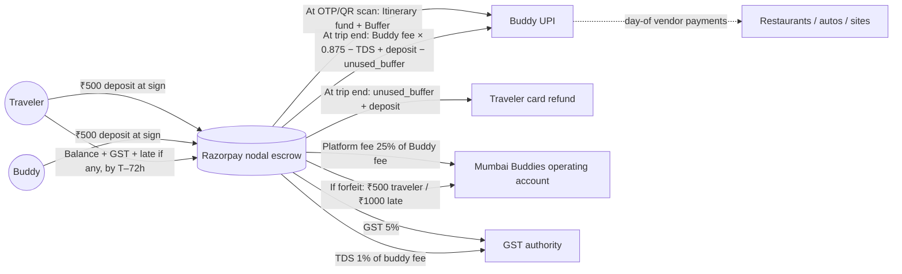

# Mumbai Buddies — Financial Model & Booking State Machine
## Claude Code Handoff Doc — v1, May 2, 2026

**Purpose:** Implement the full booking + payment lifecycle for Mumbai Buddies, from chat-based itinerary negotiation through trip completion and payouts. Every dollar amount, state transition, schema field, copy block, and edge case is in here. Read top to bottom before writing code.

**Owner:** Gaurav Sharma
**Status:** Locked — derived from a 2026-05-02 working session. Open items are explicitly tagged `[OPEN]`.
**Predecessors:** `docs/legal/research-synthesis.md`, `docs/legal/peer-company-structures.md`, the in-Notion *Legal & Compliance Playbook v1*. Read at minimum §5 (Payments & FX), §6 (GST), §7 (Student Guide Status), §8 (Liability) of the playbook before touching this.
**Out of scope (do later):** disputes UI, force-majeure adjudication tooling, multi-traveler bookings, multi-day bookings, gift-voucher/credits ledger, fraud telemetry.

---

## 1. TL;DR — The Locked Model

A booking has **four cost components** displayed as one total to the traveler:

1. **Buddy fee** — thank-you to the buddy for their time. Platform takes 25% total, split **12.5% / 12.5%** invisibly between traveler and buddy.
2. **Itinerary fund** — mutually agreed sum covering food + transport + entries **for both** traveler and buddy ("Model A — treat it like hosting a friend").
3. **Buffer** — 20% of the Itinerary fund, refundable cushion.
4. **Deposit** — ₹500 from each side, held in escrow, refundable on successful trip.

Plus **GST 5%** (Tour Operator HSN 9985, no ITC) on (Buddy fee + Itinerary fund + Buffer). Deposit is not GST-able.

**Negotiation flow:** traveler shortlists up to 3 guides → opens chat → discuss the day → guide drafts the binding itinerary with line-item costs → both sign → deposits collected → booking confirmed.

**Payment timeline:**
- At agreement signing: ₹500 deposit each side
- T–72h: full balance due
- T–72h to T–12h: late fee ₹1,000 if unpaid
- T–12h: if balance unpaid → deemed cancelled (traveler deposit forfeited, guide deposit refunded)
- Trip start: traveler shows QR, buddy scans → trip pot (Itinerary + Buffer) released to buddy's UPI
- Trip end: buddy uploads payment-proofs → reconciliation → buddy receives `(Buddy fee × 0.875 − 1% TDS) + ₹500 deposit − unused_buffer`; traveler refunded `unused_buffer + ₹500 deposit`
- T+3h: traveler gets rating link

**Buddy cancellation: zero-tolerance.** No refund + permanent ban. Platform attempts replacement-buddy sourcing.

---

## 2. The Pricing Math (Worked Example)

Use these exact numbers as the canonical test fixture. Every component (UI, schema, payout math) should reproduce these to the rupee.

**Inputs (from the signed agreement):**
- Buddy fee (gross): ₹2,000
- Itinerary fund: ₹3,000
- Buffer (20% of Itinerary fund): ₹600

**Traveler-facing breakdown:**

| Line | Amount (INR) | Notes |
|---|---:|---|
| Buddy fee (you see) | 2,250 | = `2000 × 1.125` (gross + 12.5% platform-up) |
| Itinerary fund | 3,000 | passes through to buddy on day |
| Buffer | 600 | refunded if unused |
| **Subtotal (GST-able)** | **5,850** | |
| GST 5% | 292.50 | passed through to govt |
| Refundable deposit | 500 | escrow; not GST-able |
| **Total payable** | **₹6,642.50** | |

**Traveler payment schedule:**

| Timing | Amount | What |
|---|---:|---|
| At agreement sign | ₹500 | Deposit only |
| By T–72h | ₹6,142.50 | Subtotal + GST |
| T–72h to T–12h (if balance unpaid) | +₹1,000 late fee | Forfeitable |

**Buddy-facing breakdown:**

| Stage | Amount | What |
|---|---:|---|
| At agreement sign | −₹500 | Posts deposit (held in escrow) |
| At OTP/QR scan | +₹3,600 | Itinerary fund + Buffer to UPI |
| Trip wrap-up | varies | See payout formula |

**Buddy final payout formula:**
```
net_to_buddy = (Buddy_fee × 0.875)              # post 12.5% platform-down
             − (Buddy_fee × 0.875 × 0.01)       # 1% TDS Section 194C
             + 500                               # deposit refund
             − unused_buffer                     # clawback for over-issued buffer
```

**Worked example (assume buddy spent ₹3,400 of the ₹3,600 trip pot):**

| Component | Amount (INR) |
|---|---:|
| Buddy fee × 0.875 | 1,750.00 |
| − 1% TDS | −17.50 |
| + Deposit refund | +500.00 |
| − Unused buffer (3,600 − 3,400 = 200) | −200.00 |
| **Net buddy payout** | **₹2,032.50** |

**Traveler refund at trip end:** `unused_buffer + deposit = 200 + 500 = ₹700`.

**Platform unit economics for this booking:**

| Component | Amount (INR) | Notes |
|---|---:|---|
| Platform fee (25% × Buddy fee) | 500.00 | gross take |
| − Razorpay fees (~4% of ₹6,142.50) | −245.70 | international card MDR + FX markup |
| − TDS deposit liability (passes through) | 0 | we collect from buddy, deposit with govt |
| **Net contribution per booking** | **₹254.30** | |

GST collected (₹292.50) is a pass-through to government under Tour Operator scheme — not platform revenue.

---

## 3. Booking Lifecycle State Machine

```mermaid
stateDiagram-v2
    [*] --> chat_open : Traveler opens chat with guide
    chat_open --> agreement_drafting : Guide starts drafting
    agreement_drafting --> agreement_sent : Guide sends agreement
    agreement_sent --> agreement_signed_traveler : Traveler signs
    agreement_sent --> agreement_signed_buddy : Buddy signs (parallel)
    agreement_signed_traveler --> awaiting_deposits : Both signatures captured
    agreement_signed_buddy --> awaiting_deposits : Both signatures captured
    awaiting_deposits --> deposits_held : Both ₹500 deposits captured
    deposits_held --> awaiting_balance : Booking confirmed; T–72h countdown
    awaiting_balance --> balance_paid : Traveler pays full balance
    awaiting_balance --> late_fee_due : T–72h reached, balance unpaid
    late_fee_due --> balance_paid : Traveler pays balance + ₹1000 late fee
    late_fee_due --> cancelled_no_pay : T–12h reached, balance unpaid
    balance_paid --> trip_ready : Money in escrow; awaiting trip day
    trip_ready --> in_progress : Both meet, QR scanned, trip pot released
    in_progress --> awaiting_proofs : Buddy taps "End trip" on app
    awaiting_proofs --> reconciling : Buddy uploads payment proofs
    reconciling --> completed : Payouts + refunds processed
    completed --> rated : Traveler submits rating (T+3h or later)

    agreement_drafting --> cancelled_pre_signing : Either party walks away
    agreement_sent --> cancelled_pre_signing : Either party walks away
    awaiting_deposits --> cancelled_no_deposit : Deposit window expires (24h)
    awaiting_balance --> cancelled_traveler_voluntary : Traveler cancels
    balance_paid --> cancelled_traveler_voluntary : Traveler cancels
    trip_ready --> cancelled_buddy : Buddy no-show or cancels
    in_progress --> disputed : Either party flags issue
    awaiting_proofs --> disputed : Proof mismatch flagged
    trip_ready --> cancelled_force_majeure : Verified flight cancel / medical
    balance_paid --> cancelled_force_majeure : Verified flight cancel / medical
```



### State definitions (concrete)

| State | Meaning | DB write trigger | Outbound notification |
|---|---|---|---|
| `chat_open` | Traveler initiated chat with guide. No money in flight. | `bookings` row created in `chat_open` | None |
| `agreement_drafting` | Guide is composing the binding itinerary in-app. | `agreements` row created in `draft` | None |
| `agreement_sent` | Guide has sent the draft. Traveler can review, comment, request changes. | `agreements.status = sent` | Push to traveler |
| `agreement_signed_traveler` / `agreement_signed_buddy` | One side has signed; other has not. | `agreements.{traveler,guide}_signed_at` | Push to other side |
| `awaiting_deposits` | Both signed. 24-hour window for both to pay ₹500. | Razorpay orders created for each side | Push to both |
| `deposits_held` | Both ₹500 captured into nodal escrow. Booking is committed. | `deposits.status = held` × 2 | Push to both with calendar add |
| `awaiting_balance` | Default state from confirm to T–72h. | (no transition write) | T–84h reminder push |
| `late_fee_due` | T–72h reached, balance unpaid. Late fee accruing. | `payment_events.kind = late_fee_due` | T–72h, T–48h, T–24h, T–18h pushes + email |
| `balance_paid` | Full balance captured. Money in escrow. | `payment_events.kind ∈ {balance, late_fee} status = captured` | Push: trip is on |
| `trip_ready` | Balance paid, awaiting trip day. | (no transition; status alias of balance_paid post T-12) | T-2h reminder |
| `in_progress` | OTP/QR scanned. Trip pot (Itinerary + Buffer) released to buddy UPI. | `payouts.kind = trip_pot_release status = sent` | None during day |
| `awaiting_proofs` | Buddy ended trip; uploads pending. | (no payment write) | Reminder to buddy after 1h |
| `reconciling` | All proofs uploaded; calculating final amounts. | `expense_proofs` rows + reconciliation job | None |
| `completed` | All payouts + refunds processed. | `payouts` × 2 status = sent | Buddy: payout sent. Traveler: refund sent + rating link in 3h |
| `rated` | Traveler submitted rating. | `reviews` row created | None |
| `cancelled_no_pay` | T–12h passed, traveler never paid balance. | `deposits.status = forfeited` (traveler), `refunded` (buddy) | Push both |
| `cancelled_traveler_voluntary` | Traveler explicitly cancelled. | Per cancellation tier (§7) | Push both |
| `cancelled_buddy` | Buddy cancelled or no-showed. | Buddy deposit forfeited; buddy banned. Replacement attempted. | Push both |
| `cancelled_force_majeure` | Verified flight cancel / medical / govt restriction. | Both refunded; manual ops review | Push both |
| `cancelled_pre_signing` | Walked away before both signed. | No money to move. | Optional |
| `disputed` | Manual ops review queue. Fund release paused. | Status freeze; ops Slack notification | None automatic |

---

## 4. Money Flow Diagram



### Where the money sits at each lifecycle step

| Lifecycle stage | Razorpay escrow | Buddy UPI | Platform account | Govt |
|---|---|---|---|---|
| `agreement_sent` | ₹0 | ₹0 | ₹0 | ₹0 |
| `deposits_held` | ₹1,000 (both deposits) | ₹0 | ₹0 | ₹0 |
| `balance_paid` | ₹6,142.50 + ₹1,000 = ₹7,142.50 | ₹0 | ₹0 | ₹0 |
| `in_progress` (post QR scan) | ₹3,542.50 (₹7,142.50 − ₹3,600 trip pot) | ₹3,600 | ₹0 | ₹0 |
| `completed` (all flows) | ₹0 | ₹3,600 spent + ₹2,032.50 final = balanced (₹3,400 to vendors during trip; ₹2,232.50 retained as buddy net) | ₹500 fee + ₹245.70 to Razorpay (net ₹254.30) | ₹292.50 GST + ₹17.50 TDS = ₹310 |

Reconciliation: `7,142.50 = 700 traveler refund + 2,232.50 buddy net + 3,400 vendor spend + 500 platform + 310 govt` ✓

---

## 5. Schema Additions

All migrations live under `supabase/migrations/`. Naming convention: `2026MMDDHHMMSS_<slug>.sql`. Roll out as **three migrations** in order. RLS policies follow.

### Migration 1: `2026050310000_financial_core.sql`

```sql
-- ─────────────────────────────────────────────────────────────────
-- Agreements: the binding doc between traveler and guide
-- ─────────────────────────────────────────────────────────────────
create type agreement_status as enum (
  'draft', 'sent', 'signed_traveler', 'signed_guide', 'fully_signed',
  'cancelled', 'expired'
);

create table agreements (
  id                          uuid primary key default gen_random_uuid(),
  booking_id                  uuid not null references bookings(id) on delete cascade,
  status                      agreement_status not null default 'draft',
  drafted_by_user_id          uuid not null references users(id),  -- always the buddy
  drafted_at                  timestamptz default now(),
  sent_at                     timestamptz,
  traveler_signed_at          timestamptz,
  buddy_signed_at             timestamptz,
  cancelled_at                timestamptz,
  cancelled_by_user_id        uuid references users(id),
  cancelled_reason            text,
  pdf_url                     text,                                  -- generated PDF in Supabase storage
  -- canonical numbers (all in paise, integer math)
  buddy_fee_paise             integer not null,                      -- gross, pre-platform-fee
  itinerary_fund_paise        integer not null,                      -- agreed sum
  buffer_paise                integer not null,                      -- 20% of itinerary_fund (enforced in app)
  gst_rate                    numeric(5,4) not null default 0.05,
  -- snapshot of derived numbers (recompute on agreement edit before sign)
  traveler_subtotal_paise     integer not null,                      -- = buddy_fee*1.125 + itinerary + buffer
  traveler_gst_paise          integer not null,                      -- = subtotal * gst_rate
  traveler_total_paise        integer not null,                      -- = subtotal + gst + 500*100 deposit
  trip_starts_at              timestamptz not null,
  trip_ends_at                timestamptz,                           -- optional, for half-day vs full-day display
  cancellation_terms_version  text not null default 'v1',
  created_at                  timestamptz not null default now(),
  updated_at                  timestamptz not null default now()
);

create index idx_agreements_booking on agreements(booking_id);
create index idx_agreements_status on agreements(status);

-- ─────────────────────────────────────────────────────────────────
-- Cost line items: itemized inside an agreement
-- ─────────────────────────────────────────────────────────────────
create type cost_category as enum ('food', 'transport', 'entry', 'activity', 'misc');

create table cost_line_items (
  id                  uuid primary key default gen_random_uuid(),
  agreement_id        uuid not null references agreements(id) on delete cascade,
  category            cost_category not null,
  description         text not null,                                  -- "Lunch at Bademiya", "Auto Colaba→Marine Drive"
  estimated_paise     integer not null,
  position            integer not null default 0,
  created_at          timestamptz not null default now()
);

create index idx_line_items_agreement on cost_line_items(agreement_id, position);

-- ─────────────────────────────────────────────────────────────────
-- Deposits: ₹500 from each side, escrow-held
-- ─────────────────────────────────────────────────────────────────
create type deposit_side as enum ('traveler', 'buddy');
create type deposit_status as enum ('pending', 'held', 'forfeited', 'refunded');

create table deposits (
  id                       uuid primary key default gen_random_uuid(),
  booking_id               uuid not null references bookings(id) on delete cascade,
  user_id                  uuid not null references users(id),
  side                     deposit_side not null,
  amount_paise             integer not null default 50000,
  status                   deposit_status not null default 'pending',
  razorpay_order_id        text,
  razorpay_payment_id      text,
  razorpay_refund_id       text,
  held_at                  timestamptz,
  resolved_at              timestamptz,
  resolution_reason        text,
  created_at               timestamptz not null default now(),
  unique (booking_id, side)
);

create index idx_deposits_booking on deposits(booking_id);
create index idx_deposits_status on deposits(status);

-- ─────────────────────────────────────────────────────────────────
-- Payment events: every traveler-facing money movement
-- ─────────────────────────────────────────────────────────────────
create type payment_kind as enum (
  'deposit', 'balance', 'late_fee', 'top_up', 'refund'
);
create type payment_status as enum (
  'initiated', 'captured', 'failed', 'refunded'
);

create table payment_events (
  id                                   uuid primary key default gen_random_uuid(),
  booking_id                           uuid not null references bookings(id) on delete cascade,
  user_id                              uuid not null references users(id),
  kind                                 payment_kind not null,
  -- amounts: store both INR canonical and original currency
  amount_paise                         integer not null,             -- INR paise, settled
  original_amount_minor_units          integer,                       -- e.g. USD cents at booking
  original_currency                    text,                          -- 'USD', 'EUR', etc. NULL for INR
  fx_rate_at_capture                   numeric(12,6),                 -- INR per unit of original
  status                               payment_status not null default 'initiated',
  razorpay_order_id                    text,
  razorpay_payment_id                  text,
  razorpay_signature                   text,
  initiated_at                         timestamptz not null default now(),
  captured_at                          timestamptz,
  failed_reason                        text
);

create index idx_payment_events_booking on payment_events(booking_id, kind);

-- ─────────────────────────────────────────────────────────────────
-- Expense proofs: buddy uploads at trip end
-- ─────────────────────────────────────────────────────────────────
create table expense_proofs (
  id                       uuid primary key default gen_random_uuid(),
  booking_id               uuid not null references bookings(id) on delete cascade,
  uploaded_by_user_id      uuid not null references users(id),       -- buddy
  category                 cost_category not null,
  description              text,
  amount_paise             integer not null,
  bill_url                 text,                                       -- optional
  payment_proof_url        text not null,                              -- mandatory (UPI screenshot in Supabase storage)
  created_at               timestamptz not null default now()
);

create index idx_expense_proofs_booking on expense_proofs(booking_id);

-- ─────────────────────────────────────────────────────────────────
-- Payouts: every release of money from escrow
-- ─────────────────────────────────────────────────────────────────
create type payout_kind as enum (
  'trip_pot_release',          -- itinerary + buffer to buddy at OTP scan
  'buddy_fee_final',           -- buddy fee net of TDS + deposit refund − unused buffer
  'traveler_refund',           -- unused buffer + deposit at trip end
  'cancellation_refund',       -- per cancellation tier
  'force_majeure_refund'
);
create type payout_status as enum ('pending', 'sent', 'failed');

create table payouts (
  id                       uuid primary key default gen_random_uuid(),
  booking_id               uuid not null references bookings(id) on delete cascade,
  recipient_user_id        uuid not null references users(id),
  kind                     payout_kind not null,
  -- math broken out for audit
  gross_paise              integer not null,
  tds_paise                integer not null default 0,
  buffer_clawback_paise    integer not null default 0,
  deposit_component_paise  integer not null default 0,
  net_paise                integer not null,                          -- = gross - tds - clawback + deposit
  status                   payout_status not null default 'pending',
  razorpay_payout_id       text,
  razorpay_fund_account_id text,                                      -- buddy's UPI / bank
  initiated_at             timestamptz not null default now(),
  completed_at             timestamptz,
  failed_reason            text
);

create index idx_payouts_booking on payouts(booking_id);
create index idx_payouts_recipient on payouts(recipient_user_id);
```

### Migration 2: `2026050311000_bookings_status_extension.sql`

```sql
-- Replace the existing bookings.status enum with a richer set
alter type booking_status add value if not exists 'chat_open';
alter type booking_status add value if not exists 'agreement_drafting';
alter type booking_status add value if not exists 'agreement_sent';
alter type booking_status add value if not exists 'awaiting_deposits';
alter type booking_status add value if not exists 'deposits_held';
alter type booking_status add value if not exists 'awaiting_balance';
alter type booking_status add value if not exists 'late_fee_due';
alter type booking_status add value if not exists 'balance_paid';
alter type booking_status add value if not exists 'trip_ready';
alter type booking_status add value if not exists 'awaiting_proofs';
alter type booking_status add value if not exists 'reconciling';
alter type booking_status add value if not exists 'rated';
alter type booking_status add value if not exists 'cancelled_no_pay';
alter type booking_status add value if not exists 'cancelled_traveler_voluntary';
alter type booking_status add value if not exists 'cancelled_buddy';
alter type booking_status add value if not exists 'cancelled_force_majeure';
alter type booking_status add value if not exists 'cancelled_pre_signing';
alter type booking_status add value if not exists 'cancelled_no_deposit';

-- Add OTP/QR fields to bookings
alter table bookings add column if not exists trip_qr_token text;        -- generated when trip_ready
alter table bookings add column if not exists trip_qr_scanned_at timestamptz;
alter table bookings add column if not exists trip_qr_scanned_by_user_id uuid references users(id);
alter table bookings add column if not exists ended_by_buddy_at timestamptz;

-- Migrate existing rows (best-effort)
update bookings set status = 'completed' where status = 'completed';
update bookings set status = 'in_progress' where status = 'in_progress';
update bookings set status = 'balance_paid' where status = 'confirmed';
update bookings set status = 'awaiting_deposits' where status = 'guide_accepted';
update bookings set status = 'agreement_sent' where status = 'pending';
```

### Migration 3: `2026050312000_financial_rls.sql`

```sql
-- Travelers and buddies see their own agreements / deposits / payments / proofs / payouts
alter table agreements enable row level security;
alter table cost_line_items enable row level security;
alter table deposits enable row level security;
alter table payment_events enable row level security;
alter table expense_proofs enable row level security;
alter table payouts enable row level security;

-- Helper: link booking → user_ids both sides
create or replace function user_can_see_booking(b_id uuid)
returns boolean language sql stable as $$
  select exists (
    select 1 from bookings b
    where b.id = b_id
      and (b.traveler_id = auth.uid() or b.guide_id = auth.uid())
  );
$$;

create policy agreements_read on agreements for select
  using (user_can_see_booking(booking_id));
create policy agreements_write_buddy on agreements for insert
  with check (drafted_by_user_id = auth.uid());
create policy agreements_update_parties on agreements for update
  using (user_can_see_booking(booking_id));

create policy line_items_read on cost_line_items for select
  using (exists (
    select 1 from agreements a where a.id = agreement_id and user_can_see_booking(a.booking_id)
  ));
create policy line_items_write_buddy on cost_line_items for insert
  with check (exists (
    select 1 from agreements a
    where a.id = agreement_id and a.drafted_by_user_id = auth.uid()
  ));

create policy deposits_read on deposits for select
  using (user_can_see_booking(booking_id));
create policy payment_events_read on payment_events for select
  using (user_can_see_booking(booking_id));
create policy expense_proofs_read on expense_proofs for select
  using (user_can_see_booking(booking_id));
create policy expense_proofs_write_buddy on expense_proofs for insert
  with check (uploaded_by_user_id = auth.uid());
create policy payouts_read on payouts for select
  using (user_can_see_booking(booking_id));
```

---

## 6. Agreement Template (Markdown source for PDF generation)

The agreement is generated from the structured data in `agreements` + `cost_line_items` and rendered to a PDF stored at `agreements.pdf_url`. Use a server-side renderer (`puppeteer` on a Supabase Edge function, or `react-pdf` from a Node lambda).

```
# Mumbai Buddies — Day Agreement
**Agreement #{{agreement.id_short}}** · Drafted {{agreement.drafted_at}}

This is a binding agreement between **{{traveler.full_name}}** ("Traveler") and
**{{buddy.full_name}}** ("Buddy"), for a layover-day experience facilitated by
Mumbai Buddies (Layover Buddies Pvt Ltd) on **{{trip_starts_at | format_date}}**.

## The Plan
{{itinerary.day_overview}}

## What we'll do (and what it costs)
{{#each cost_line_items}}
- **{{this.description}}** ({{this.category}}) — ₹{{this.amount}}
{{/each}}

**Day's expenses (food, transport, entries — for both of you): ₹{{itinerary_fund}}**
> This is the agreed budget for the day. The Buddy will pay vendors on the ground
> from this fund. Treat it like hosting a friend — it covers things for the two of you.

**Buffer (20% cushion): ₹{{buffer}}**
> Refunded to the Traveler if unused. If the day runs over the buffer, the Buddy
> will tap the Traveler in-app to top up — never a surprise.

**Buddy fee: ₹{{buddy_fee_traveler_view}}**
> The Traveler's thank-you to the Buddy for their time and local knowledge.

## What you pay
| Line | Amount |
|---|---:|
| Buddy fee | ₹{{buddy_fee_traveler_view}} |
| Day's expenses | ₹{{itinerary_fund}} |
| Buffer | ₹{{buffer}} |
| GST (Tour Operator, 5%) | ₹{{gst}} |
| Refundable deposit | ₹500 |
| **Total** | **₹{{traveler_total}}** |

**Payment schedule:**
- Today (at signing): ₹500 (deposit only)
- By {{T_minus_72}}: ₹{{balance_due}}
- After that: ₹1,000 late fee. Booking auto-cancels at {{T_minus_12}} if balance is unpaid.

## What the Buddy gets
₹{{buddy_take_home_estimate}} after platform fee, taxes, and trip-end reconciliation.
Plus: their ₹500 deposit returned after the trip.

## Cancellation
- **Traveler cancels >72h before:** Full refund minus payment-gateway fees.
- **Traveler cancels 24–72h before:** 50% refund.
- **Traveler cancels <24h before:** Forfeit; credit voucher (30 days).
- **Traveler doesn't pay balance by 12h before:** Forfeit traveler deposit + late fee. Buddy deposit returned.
- **Buddy cancels or no-shows:** Full refund to Traveler + ₹500 platform credit; Buddy permanent ban.
- **Force majeure (verified flight cancel, medical):** Full refund both sides with proof.

## Conduct
Both parties agree to behave respectfully and lawfully. The Buddy is an independent
local — not an employee of Mumbai Buddies. The Traveler is the Buddy's guest, not their
client. The Buddy is not a licensed tour guide and won't conduct paid guiding inside
ASI-protected monuments — if your plan includes Elephanta Caves or similar, an on-site
licensed guide is recommended (~₹500–1,500 cash, not included).

## Safety
The Traveler can trigger SOS in-app at any time. Live trip tracking is shared with
Mumbai Buddies and (optionally) the Traveler's emergency contact.

## Signatures
- Traveler: {{traveler.full_name}} signed at {{traveler_signed_at | "_______"}}
- Buddy: {{buddy.full_name}} signed at {{buddy_signed_at | "_______"}}

---
*Mumbai Buddies is a technology platform connecting travelers with independent local
companions. Subject to our [Terms of Service](https://...) and [Privacy Policy](https://...).*
```

---

## 7. Cancellation & Refund Cascade (Truth Table)

Implement as a single function `compute_cancellation_resolution(booking, trigger_event, trigger_actor) → resolution`. Persist the resolution to `bookings.cancelled_resolution_jsonb` for audit.

| Trigger | Trigger time | Traveler deposit | Buddy deposit | Itinerary + Buffer | Buddy fee | Late fee | Buddy ban? |
|---|---|---|---|---|---|---|---|
| **Trip completed normally** | T+0 | Refunded ₹500 | Refunded ₹500 | Used + unused refunded to traveler | Released to buddy net | N/A | No |
| **Traveler cancels** | >72h pre-trip | Refunded ₹500 minus PG | Refunded ₹500 | If paid: refunded minus PG | N/A | N/A | No |
| **Traveler cancels** | 24–72h pre-trip | 50% refund (₹250) | Refunded ₹500 | If paid: 50% refund | N/A | N/A | No |
| **Traveler cancels** | <24h pre-trip | Forfeited (or 30-day credit voucher) | Refunded ₹500 | If paid: forfeited (or voucher) | N/A | N/A | No |
| **Traveler doesn't pay balance** | T–72h passes | Held; late fee accruing | Held | N/A | N/A | ₹1,000 due | No |
| **Traveler pays late fee but not balance** | T–12h | Forfeited (₹500) | Refunded ₹500 | N/A | N/A | Forfeited (₹1,000) | No |
| **Traveler pays nothing** | T–12h | Forfeited (₹500) | Refunded ₹500 | N/A | N/A | N/A | No |
| **Buddy cancels** | Any time post-deposit | Full refund + ₹500 platform credit | Forfeited (₹500) | Refunded if released | N/A | Waived | **Yes — permanent** |
| **Buddy no-show on trip day** | Trip day | Full refund + ₹500 platform credit | Forfeited (₹500) | Refunded | N/A | Waived | **Yes — permanent** |
| **Force majeure (verified)** | Any time | Full refund | Full refund | Full refund | N/A | Waived | No |
| **Trip aborted mid-way** | After QR scan | `[OPEN]` ops review | `[OPEN]` ops review | `[OPEN]` partial | `[OPEN]` partial | N/A | Possible |
| **Disputed completion** | Post-trip | Held pending review | Held pending review | Held | Held | N/A | Possible |

**Implementation note:** the `cancelled_*` and `disputed` branches should pause all in-flight Razorpay payouts immediately. Reconciliation is a manual ops decision flowing through the admin console (existing `/admin/sos`-style review queue, extended).

---

## 8. Currency Conversion

### Display
- Geo-detect traveler's country at first session (Cloudflare/Vercel geo headers, fallback IP API).
- Map to currency: `IN→INR`, `US→USD`, `GB→GBP`, `DE→EUR`, `AE→AED`, `SG→SGD`, `AU→AUD`, `CA→CAD`, `JP→JPY`. Fallback `USD` for unknown.
- Display every price in geo-currency primary, INR in lighter weight underneath. Example: `**$80** · ₹6,642`.
- Use a single FX rate per session, cached for 6h. Pull from RBI reference rate API or fallback to OpenExchangeRates.
- **All persisted amounts in DB are paise (INR integer cents).** Original currency snapshot is stored on `payment_events` only for receipt rendering.

### Capture
- At checkout, the user is shown the local-currency total. Razorpay International captures in that currency. Razorpay returns INR settled amount + FX rate at capture.
- Persist both: `payment_events.original_amount_minor_units`, `original_currency`, `fx_rate_at_capture`. This anchors any future refund/dispute math.

### Refunds
- Refunds always processed in INR via Razorpay. Razorpay reverse-FX's at the rate on the refund date.
- Add to ToS verbatim: *"Refunds are processed in INR and converted to your card's currency at the rate applicable on the refund date. Small currency-conversion variances of 1–2% may apply between the booking and refund dates."*

### Settlement
- All settlement to the Layover Buddies INR current account (not EEFC) for Year 1. EEFC consideration revisited if vendor USD spend is high.
- Razorpay handles FIRC issuance per transaction. Persist the FIRC ID on `payment_events.razorpay_firc_id` (add column in a follow-up migration when Razorpay onboarding is complete).

### Cost-of-acceptance
- Bake **4.0–4.5%** all-in into the 12.5% traveler-side platform fee. Budget 4.0% for low-spread cards (Visa/Mastercard from US/UK/EU), 4.5% for AMEX or non-major-market cards.
- This is *the* margin lever; revisit quarterly with actual Razorpay invoices.

### Late fees, forfeits
- Always assessed in **INR** at the FX rate on the day. Cleanest for accounting — no FX disputes.

---

## 9. Razorpay Integration Plan

### Account configuration prerequisites (one-time, blocked on incorporation)

1. Layover Buddies Pvt Ltd incorporated.
2. Current account opened (Razorpay Rize bundles this).
3. AD Code activated at the bank branch.
4. IEC obtained from DGFT.
5. Razorpay International activated with:
   - Purpose code `P0802` (Other tourist services)
   - PA-CB classification confirmed
   - Settlement cycle T+2 to T+5 (default fine)
6. Razorpay Route enabled (for sub-account splits).
7. Razorpay Payouts (X) enabled (for buddy UPI transfers).

### Money-flow primitives we use

| Primitive | Purpose | Doc |
|---|---|---|
| Razorpay Orders | Create per payment intent (deposit, balance, late fee, top-up) | https://razorpay.com/docs/api/orders/ |
| Razorpay Payments | Capture from traveler card | https://razorpay.com/docs/api/payments/ |
| Razorpay Route | Split a captured payment between linked accounts (us + held escrow) | https://razorpay.com/docs/route/ |
| Razorpay Refunds | Refund deposit / unused buffer / cancellations | https://razorpay.com/docs/refunds/ |
| Razorpay Payouts (X) | Push INR to buddy's UPI VPA / bank | https://razorpay.com/docs/payouts/ |
| Webhooks | `payment.captured`, `payment.failed`, `refund.processed`, `payout.processed`, `payout.failed` | https://razorpay.com/docs/webhooks/ |

### Server-side endpoints to build

Implement as **Supabase Edge Functions** (Deno runtime). Each function is one verb.

| Endpoint | When called | What it does |
|---|---|---|
| `POST /razorpay/order/deposit` | Both sides hit "Sign agreement" | Create RP order for ₹500 each side; return order_id + key for client-side checkout |
| `POST /razorpay/order/balance` | Traveler hits "Pay balance" | Create RP order for `subtotal + GST + (late_fee if past T-72h)`; return order_id |
| `POST /razorpay/webhook` | Razorpay calls us | Verify signature; update `payment_events.status`; trigger state transitions |
| `POST /razorpay/order/topup` | Buddy taps "Need more" during trip | Create RP order for the requested amount |
| `POST /payouts/trip_pot` | Triggered by QR-scan handler | Razorpay Payouts call → buddy UPI for `itinerary_fund + buffer` |
| `POST /payouts/finalize` | Triggered when reconciling completes | Buddy fee net + deposit refund − unused buffer → buddy UPI; unused buffer + deposit → traveler refund |
| `POST /payouts/refund` | Cancellations + force majeure | Compute resolution per §7; issue Razorpay refunds |
| `POST /qr/scan` | Buddy scans the traveler's QR | Verify token, mark booking `in_progress`, call `/payouts/trip_pot` |

### State machine integration

The webhook handler is the brain. State transitions are write-once; concurrency-safe via row-level locks on `bookings.id`.

```ts
// Pseudocode for the webhook handler
async function razorpayWebhook(event: RazorpayEvent) {
  await db.transaction(async (tx) => {
    const booking = await tx.lockBookingRow(event.notes.booking_id);

    switch (event.type) {
      case "payment.captured":
        await tx.updatePaymentEvent(event.payload.payment.id, "captured");
        if (event.notes.kind === "deposit") {
          await tx.updateDepositStatus(booking.id, event.notes.side, "held");
          if (await tx.bothDepositsHeld(booking.id)) {
            await tx.transitionBooking(booking.id, "deposits_held");
            await scheduleBalanceReminders(booking.id, booking.trip_starts_at);
          }
        }
        if (event.notes.kind === "balance") {
          await tx.transitionBooking(booking.id, "balance_paid");
          await tx.generateTripQrToken(booking.id);
        }
        // ... etc
        break;

      case "payout.processed":
        await tx.updatePayoutStatus(event.payload.payout.id, "sent");
        if (event.notes.kind === "buddy_fee_final") {
          await tx.transitionBooking(booking.id, "completed");
          await scheduleRatingLink(booking.id, "+3 hours");
        }
        break;
    }
  });
}
```

### Idempotency + reliability

- Every Razorpay-bound API call must use a deterministic `Idempotency-Key` header keyed on `(booking_id, kind, attempt)`.
- Webhooks must verify signature using `RAZORPAY_WEBHOOK_SECRET`. Reject silently on signature mismatch.
- Webhooks may arrive out of order or be replayed. Use the `payment_events.captured_at` field as the canonical source of truth, not webhook ordering.
- Failed webhook deliveries: Razorpay retries 5 times over 24h. Build a reconciliation job that polls Razorpay every 15 min for stale `initiated` payment_events older than 30 min and resolves them.

### Cron / scheduled jobs

| Job | Cadence | Purpose |
|---|---|---|
| `bookings.balance_reminder` | Hourly | Push reminders at T–84h, T–48h, T–24h, T–18h |
| `bookings.late_fee_assess` | Hourly | At T–72h, transition `awaiting_balance → late_fee_due` and add ₹1,000 fee to next balance order |
| `bookings.no_pay_cancel` | Hourly | At T–12h, transition `late_fee_due → cancelled_no_pay`; trigger forfeitures |
| `bookings.deposit_window_expire` | Hourly | If `awaiting_deposits` > 24h old → `cancelled_no_deposit` |
| `payments.reconcile_stale` | Every 15 min | Poll Razorpay for `initiated` payments > 30 min old |
| `payouts.reconcile_stale` | Every 15 min | Same for payouts |
| `bookings.rating_link_send` | Every 5 min | T+3h post-completion → push notification with rating link |

---

## 10. Traveler-Facing Copy (canonical strings)

Single source of truth lives at `mobile/lib/copy/financial.ts`. UI components import from there — no inline copy.

### Pricing screen (post-agreement-draft)

```
The plan
{{day_overview}}

What this includes
₹{{buddy_fee_traveler_view}}  ·  Buddy fee
                             Your thank-you to {{buddy_first_name}} for the day.

₹{{itinerary_fund}}  ·  Day's expenses
                       Food, transport, entries — for both of you.
                       {{buddy_first_name}} handles the cash on the ground.

₹{{buffer}}  ·  Buffer (20% cushion)
              Refunded if unused. We'll never surprise you with extra charges.

₹{{gst}}  ·  GST (Tour Operator, 5%)

₹500  ·  Refundable deposit
        Returned after the trip.

——————————————————————————
Total: ₹{{traveler_total}}

Today: ₹500 (deposit only)
By {{T_minus_72_human}}: ₹{{balance_due}}

[Read the full agreement →]
[Sign and pay deposit]
```

### Day's expenses explainer (info bubble)

> **Why "for both of you"?**
> Mumbai Buddies isn't a tour. {{buddy_first_name}} is your local for the day — you'll
> share lunch, autos, entry tickets, the works. The day's expenses cover all of that
> for the two of you, the way you'd cover a friend showing you their city. Whatever
> isn't spent comes back to you.

### Buffer explainer

> **About the buffer**
> The buffer is a 20% cushion on top of the day's expenses. If the day runs short, you
> get the full ₹{{buffer}} back. If it runs long, your buddy taps you in-app to top up —
> always with your approval, never a surprise.

### Deposit explainer

> **About the deposit**
> ₹500 from each of you, held by Mumbai Buddies until the trip wraps. Both refunded
> after a successful day. The deposit exists so neither side flakes.

### Late-fee state

```
⚠ Heads up
Your balance was due {{hours_overdue}}h ago. A ₹1,000 late fee now applies.
If we don't receive payment by {{T_minus_12_human}}, the booking will cancel
automatically and your ₹500 deposit will be forfeited.

Pay now: ₹{{balance_due_with_late_fee}}
```

### Trip start (QR display)

```
Show this to {{buddy_first_name}}
{{QR_CODE}}

When they scan, your day begins. We'll release the day's expenses to them so they
can take care of payments on the ground.
```

### Top-up prompt (buddy initiated, traveler-facing)

```
{{buddy_first_name}} needs ₹{{requested}} more from the buffer
For: {{purpose_short}}

Buffer remaining: ₹{{remaining}}
Amount to add: ₹{{requested}}

[Approve ₹{{requested}}]   [Decline]
```

### Trip-end (post reconciliation)

```
Day complete with {{buddy_first_name}}
Day's expenses spent: ₹{{spent}}
Refunded to you:      ₹{{unused_buffer + 500}}
                       (₹{{unused_buffer}} unused buffer + ₹500 deposit)

How was the day? [Rate your experience →]   (also emailed to you in 3 hours)
```

---

## 11. Buddy-Facing Copy (canonical strings)

Buddies see *different* numbers — their own world.

### Agreement-sign screen (buddy)

```
Agreement with {{traveler_first_name}}
{{trip_starts_at_human}}

Your take-home (estimate)
₹{{buddy_take_home_estimate}}

= Buddy fee {{buddy_fee_buddy_view}}
- Platform fee (12.5%): -{{platform_fee_buddy_side}}
- TDS (1%): -{{tds_estimate}}
+ Deposit returned: +₹500
- Any unused buffer (rare)

[Read the full plan]
[Sign and post ₹500 deposit]
```

### Trip start (buddy POV)

```
Scan {{traveler_first_name}}'s QR to begin

[Open camera]

When you scan:
₹{{itinerary_plus_buffer}} will land in your UPI within ~30 seconds.
This is the day's spending money for both of you.

Keep payment screenshots — you'll upload them at the end.
```

### Trip wrap-up

```
End trip
Upload payment proofs for everything you spent today.

[Upload proofs] (one at a time or as a batch)

You can also add bills (optional but nice for record).

Once you submit, we'll:
- Release your buddy fee + deposit to UPI
- Refund any unused buffer to {{traveler_first_name}}

This usually happens within 30 minutes.
```

### Buddy reconciliation receipt

```
Day complete · {{trip_date_human}}
Buddy fee:                      ₹{{buddy_fee_buddy_view}}
- Platform fee (12.5%):         -₹{{platform_fee_buddy_side}}
- TDS (1%):                     -₹{{tds}}
+ Deposit returned:             +₹500
- Unused buffer:                -₹{{unused_buffer}}
————————————————————————
Sent to your UPI:               ₹{{net}}

Any questions? Tap support.
```

### Top-up request flow (buddy initiated)

```
Need more from the buffer?
Remaining: ₹{{remaining}}
Spent today: ₹{{spent}} of ₹{{trip_pot}}

How much more do you need?
[Slider: ₹100 – ₹2000]

What's it for?
[Lunch / Transport / Entry / Other]

[Send request to {{traveler_first_name}}]
```

---

## 12. Edge-Case Ledger

| # | Scenario | Resolution |
|---|---|---|
| 1 | Both deposits paid, but traveler cancels in the 24h-window before balance is due | Treat as "Traveler cancels >72h" branch; refund minus PG fees |
| 2 | Buddy is 20 min late at meeting point, traveler nervous | Trip pot release is contingent on QR scan, not arrival time. Add a 30-min "Buddy late" state with auto-push to ops if no QR scan. |
| 3 | Both meet but trip aborts after 1 hour (unrelated reason — traveler illness) | `[OPEN]` Manual ops review. v1: full buddy fee + 50% itinerary used → split, full buffer refunded. |
| 4 | Buddy spends from trip pot but never uploads proofs | After 24h post `awaiting_proofs`, escalate to ops. Forfeit unused-buffer claim against buddy fee — traveler gets `(trip_pot - declared_use)` back, buddy gets fee minus zero buffer (most punitive interpretation). Buddy ban after 2 incidents. |
| 5 | Buddy uploads proofs totaling MORE than trip pot | Cap at trip pot. Excess is buddy's loss (they over-spent without top-up approval). Notify buddy. |
| 6 | Razorpay refund fails | Retry 3 times over 24h. After that, manual UPI/bank transfer by ops. Persist `payouts.failed_reason`. |
| 7 | Traveler has multiple bookings same day with different buddies | Allowed but flagged in admin. Each booking is independent. |
| 8 | Buddy has overlapping bookings | Disallowed at booking level. `bookings` table needs an `EXCLUDE` constraint on `(guide_id, [trip_starts_at, trip_ends_at])`. |
| 9 | Traveler tops up buffer mid-trip but the day still under-spends | Top-up is treated identically to the original buffer; refunded if unused. |
| 10 | GST rate changes mid-booking lifecycle | Lock `gst_rate` at agreement signing time. Use snapshot, ignore later changes. |
| 11 | FX rate moves dramatically between booking and refund | Refund in INR; traveler bears FX delta. Disclosed in ToS. No platform compensation. |
| 12 | Force majeure but only one side has proof | Refund the side with proof. Other side: ops review. |
| 13 | OTP/QR scan succeeds but Razorpay payout fails to buddy UPI | Retry 5 times. Allow buddy to enter alternate VPA in-app within 1h. After that, manual ops resolution. |
| 14 | Buddy bills > traveler agrees to in proof verification | Ops review. v1: trust buddy proofs unless traveler disputes within 24h post-trip. |
| 15 | Buddy already banned tries to create new account | Hash IP + Aadhaar last-4 + phone for re-registration block. Manual review. |
| 16 | Traveler card declined at balance time but they pay 1 hour later | Allowed — `payment_events.kind=balance attempt=2`. Late fee assessed only if past T–72h. |
| 17 | Currency the traveler's card uses isn't in our display set | Default display in USD; capture in card currency via Razorpay regardless. |
| 18 | Traveler requests cancellation right after deposit, before balance due | Treat as voluntary cancel — apply tier based on trip-time proximity. |

---

## 13. Implementation Order (sequenced)

Build in **four phases**. Don't skip ahead — each phase has dependencies on the previous.

### Phase 1: Schema + state machine (week 1)
1. Run the three migrations (§5).
2. Generate Supabase types (`npx supabase gen types`).
3. Implement the booking state machine as a single typed reducer in `mobile/lib/booking/stateMachine.ts`.
4. Unit test every transition in the table (§3).

### Phase 2: Agreement flow (week 2)
1. Build the chat → agreement-drafting UI (buddy side).
2. Build the agreement viewer + sign UI (both sides).
3. PDF rendering function (Supabase Edge: puppeteer with the template from §6).
4. Razorpay deposit order endpoint + checkout integration.
5. Webhook handler for deposit captures.
6. Both-signed + both-deposits → `deposits_held` transition + push notifications.

### Phase 3: Balance + cancellation (week 3)
1. Razorpay balance-order endpoint + checkout.
2. Balance webhook handler.
3. Cron jobs: `balance_reminder`, `late_fee_assess`, `no_pay_cancel`, `deposit_window_expire`.
4. Cancellation resolver function (truth table from §7).
5. Refund issuance via Razorpay refunds API.
6. Admin console: cancellation review queue (extend the `/admin/sos`-style page with a `cancellations` tab).

### Phase 4: Trip lifecycle + reconciliation (week 4)
1. QR generation + scan endpoints.
2. Razorpay Payouts (X) integration for trip-pot release.
3. Top-up flow (in-app) + push approval to traveler.
4. Trip-end "upload proofs" UI + storage.
5. Reconciliation function: compute unused buffer, run final payouts.
6. Rating link cron (T+3h push).
7. Buddy "trip wrap-up receipt" screen + traveler "day complete" screen.
8. Admin console: payout status dashboard.

### Phase 5: Polish (week 5+)
1. Currency display + FX caching layer.
2. Edge-case audit pass against §12 — at least cases 1, 2, 4, 5, 6, 8, 13, 16.
3. ToS text updated with refund/FX disclosures.
4. End-to-end smoke test on iOS sim + Razorpay test account against the worked-example fixture in §2.

---

## 14. Open Questions / Future Work

Tagged `[OPEN]` throughout. Consolidated:

- **Force-majeure adjudication.** What counts as "verified"? Flight-cancel screenshot? Hospital discharge? Government advisory? Need a published policy + an ops queue.
- **Buddy emergency override.** If a buddy genuinely can't make it (medical), we want to honour the situation without auto-banning. Need an "Apply for review before cancellation" path with a 6h response SLA.
- **Trip aborted mid-way (case 3 in §12).** Pro-rata logic not specified. Recommend ops-discretion v1; codified rules v2.
- **Multi-traveler bookings.** Couples / families. Does the deposit scale per traveler? Probably one deposit, but more capacity bookings raise insurance considerations. Defer.
- **Multi-day bookings.** The state machine assumes single trip_starts_at → trip_ends_at. Multi-day breaks the OTP/QR-once model. Defer.
- **Tip flow.** Optional traveler tip post-trip. Probably a separate `payment_events.kind = tip`, 100% to buddy, no platform cut. Defer.
- **Buddy dispute path.** What if a buddy thinks the traveler under-paid the agreed amount or refused to top up the buffer? Need a "raise dispute" button on the wrap-up screen. Defer.
- **Receipt/invoice generation for travelers.** GST-compliant tax invoice with company name, GSTIN, HSN 9985, Place of Supply. Required at scale; nice-to-have v1.
- **EU-resident GDPR overlay.** Cookie banner + privacy-policy mentions. Mostly Marketing's problem; flag here for completeness.

---

## 15. Pre-flight Checks Before Coding

- [ ] Pvt Ltd incorporated; current account opened (blocks all Razorpay onboarding)
- [ ] Razorpay International activated with PA-CB classification
- [ ] AD Code at bank branch
- [ ] IEC from DGFT
- [ ] Razorpay Route + Payouts (X) enabled
- [ ] `RAZORPAY_KEY_ID`, `RAZORPAY_KEY_SECRET`, `RAZORPAY_WEBHOOK_SECRET` in `.env.local`
- [ ] Test fixtures from §2 captured in `mobile/lib/booking/__fixtures__/canonical.ts`
- [ ] CA briefed on the 5%-without-ITC GST scheme and 1% TDS Section 194C
- [ ] ToS draft has refund tiers + FX disclosure (lawyer review pass)

If any of the above are blocked, **document the blocker explicitly in the task and continue with mocks** — Razorpay test mode covers all the API surfaces we need without a live merchant account.

---

**Document status:** v1, May 2, 2026. Derived from the locked decisions in the `project_layover_buddies_financial_model.md` memory file. Revisit when force-majeure policy is finalized.

**Next handoff:** none — this *is* the handoff. Pass to Claude Code when ready.
